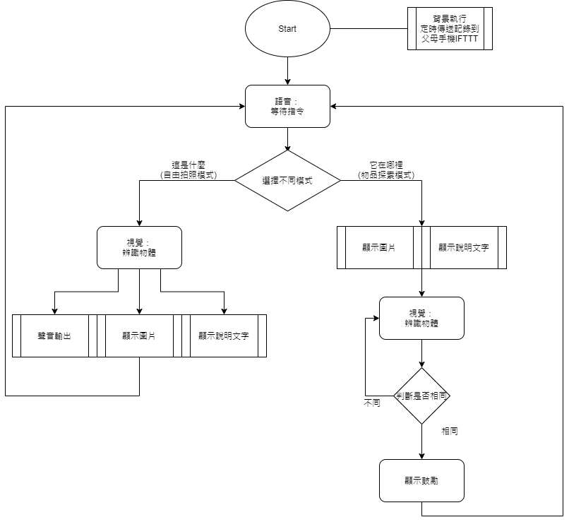

# 學習相機

## 相關套件安裝
```bash
pip install gtts
pip install fysom
```

## 執行方式

### 執行程式
```bash
python main.py --video 2 # 這個數字取決於你電腦設備的順序，需要嘗試看看
```

### 語音輸入指令
+ 預設待機在`listen`模式
  + 說出**「這是什麼」**進入自由拍照模式
  + 說出**「它在哪裡」**進入物品探索模式
+ 在自由拍照模式中
  + 會找出超過閥值中連續5次最大的結果回傳
+ 在物品探索模式中
  + 會隨機產生一個題目
  + 再持續拍照到對為止

### 階段結構

